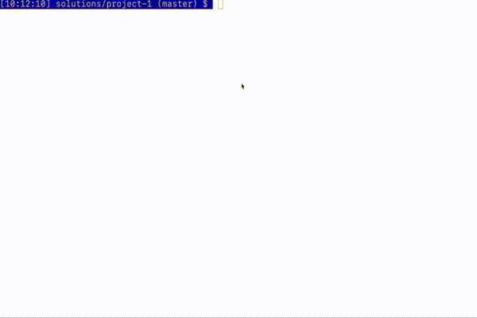

# COP 3530 - Data Structures and Algorithms I 
# Project 1 
## Due: Friday, January 31st 11:59 P.M. CST 

## Objective: 
This project is meant to help you review concepts of programming in C++ while also getting used to the environment for this course.
In this project, you are asked to create a game called Numerical Wagers.
You will need to be able to perform basic file input, create classes, and manipulate basic data structures in C++.
You will also need to create a Makefile to compile your program.
Information about creating Makefiles is in your Zybook.

## Problem Description: 
You will be given files in the following format (See [questions.txt](questions.txt) for an example):
```
numerical_answer1 question1
numerical_answer2 question2
numerical_answer3 question3
numerical_answer4 question4
```
 
Each line of the file composes a question and answer first, with the answer first for easier file handling.
A file can contain any number of questions and answers.
Questions can be made up of multiple words.
Answers will be a single integer value.
You will need to create a class for holding each question and answer pair.
As you read the file, you will create a new object for the question and answer pair and then place it into a vector.
The game will use these questions and answers as the puzzles for the game of Numerical Wagers.
You will need to select one of the questions from the vector.

The idea behind the game is to be able to guess the answer to the question by guessing each digit in the number.
You are allowed two missed guesses.
If a player guesses an incorrect digit, then they have one less missed guess that they can make.
If a player guesses a correct digit, then they can make the next guess without any penalties.
Players will start with 200 points.
To make the game more interesting, for each question, the player will have to wager a points.
If the player can guess the complete numerical answer (all the digits in the number), then they win the wagered number of points.
Otherwise, they lose all points.
The game is over after three rounds or after the player runs out of points (in which case they lose).
They can then either choose to start another game or quit the game.   

## Testing
Included in this repository is a unit test file ([test/TestCase.cpp](test/TestCase.cpp)).
This file can be run by typing `make test` or `make clean test` at the command line.
When you first run the test, all tests will fail.
Try to work on the tests one-at-a-time from top to bottom writing the classes and methods to enable them to pass.
After you get a single test to pass, save your code to that point via `git add .`, `git commit -m "DESCRIPTION OF CODE ADDED"`, `git push origin master`.
Committing and pushing code early and often will save you time in the end.
This unit test file will be run as part of the grading process, so be sure to run them yourself.

The point of using this testing framework is so that you can build out the smaller parts of your game without having to interact with the game, or develop the main application too early.
You can build out most (if not all) of the functionality your main class will need before you even start building main.
As a matter of fact, your main class can use some of the declarations and method calls in exactly the same way as the unit tests.

## Creating the Game 
You are required to implement the classes described below ([Code Organization for Numerical Wagers](code-organization-for-numerical-wagers)), and a main.cpp.
Each class should be divided into a .cpp and .hpp file.
Upon the start of the game, your terminal should display the following:
```
Welcome to Numerical Wagers!
Please enter the name of the file containing your questions:
```
 
The player will then type the name of a file with their questions into the terminal.
Afterward, the screen should look similar to the following:
```
Welcome to Numerical Wagers!
Please enter the name of the file containing your questions: questions.txt
        	
Round 1
Next Question: Number of years in a score
Current Points: 200
Please make a wager:
```
 
This shows the player the next question that will be asked. At this point, the player must enter a wager of points between 1 and their current points (in this case 200).
The screen will then look like:
 
```
Current Question: Number of years in a score
Current Answer: _ _
Missed Guesses: 0
Please guess a digit:
```
 
We will use the character '\_' to indicate a missing digit.
"Missed Guesses" refers to the number of missed guesses that the player has (maximum 2).
The player is being prompted to enter a possible digit.
At this point, one of two things should happen.
Either the player guesses a correct digit or they guess an incorrect digit.
For simplicity, you may assume that the player will only guess digits and that no other inputs will be entered (this is not a safe assumption in real world applications!).
 
If they make a correct guess, the screen will look like this:
 
 ```
Current Question: Number of years in a score
Current Answer: _ _
Missed Guesses: 0
Please guess a digit:2
 
Current Question: Number of years in a score
Current Answer: 2 _
Missed Guesses: 0
Please guess a digit:
```
 
If they make an incorrect guess, the screen will look like this:
 
```
Current Question: Number of years in a score
Current Answer: _ _
Missed Guesses: 0
Please guess a digit:4
 
Current Question: Number of years in a score
Current Answer: _ _
Missed Guesses: 1
Please guess a digit:
```
 
The round will proceed in this way until either they correctly guess all digits in the answer or until they made 2 missed guesses.
At which time, the game should show the player the wager screen again with either their points earned or lost:
 
```
Round 2
Next Question: Number of bones in the human body
Current Points: 220
Please make a wager:
```
 
The game will end after either 3 rounds or after the player has ran out of points.
At this point, the game should give the final score and prompt the player to either play again or quit:
 
```
Final points: 0
Would you like to:
1. Play a new game
2. Quit the game
Please make a selection:
```
 
If the player chooses to play a new game, the game will prompt the player to enter a new file as they did when first running the program.

## Sample run


## Code Organization for Numerical Wagers
You will need to make sure that your code meets the following specifications.
Note that there is some room for interpretation, but a general code outline is given below.
 
### The Main File
The main file shall create a Game instance and utilize its methods to implement the game.
Separating the logic that displays the menus to the player from the game of Numerical Wagers allows us to reuse the existing Numerical Wagers game in different programs or to change out our current view for a new one if we so choose.
Additionally, the main class can be used to handle the number of questions in a game as well as allow a user to select the option to play again.

### The Question Class


This class is responsible for storing the question and answer for a single question.
In addition to a parameterized constructor, this class should have the following methods:
* `GetText ()`
	* Returns an std::string that is the question body.
* `AnswerContainsDigit (char)`
	* Returns a boolean (true or false) if the answer contains the character passed in.
	* This function is useful for knowing when to increment the number of incorrect guesses.
* `GetAnswerWithPlaceholders (std::vector<char>)`
	* Returns an std::string of the answer but digits in the answer that have not yet been guessed by the user should show an underscore.
		* For example, if a vector containing 1, 2, and 3 are passed in and the question's answer is 253, this function returns "2_3".
* `AllDigitsGuessed (std::string)`
	* Returns true if no underscore is present in the input string, false otherwise.
	* A simple check that searching an input string for the underscore character.
	* Use this function on the response from GetAnswerWithPlaceholders.


### The QuestionBank Class


This class is a container class that is responsible for reading the input file and storing a list of questions.
* `QuestionBank (std::string)`
	* This parameterized constructor accepts a filename as an std::string where the questions to be loaded reside.
* `void LoadQuestions()`
	* This helper function should read the file and instantiate the questions one by one, adding them to the `questions` vector.
* `GetNextQuestion()`
	* This function should return a question from the list for use by the Game class, described below.

### The Game Class


This class is used to implement the game itself and is responsible for interacting with the user, updating the score, etc.

* `Game(QuestionBank* qs)`
	* Takes a pointer to a QuestionBank object which holds the questions to be used in the game.
* `AskQuestion ()`
	* Returns an int, which is the user score after the next question is completed, either successfully, or unsuccessfully.
	* This function should utilize the functions that follow to implement the gameplay.
* `AdjustPoints (bool)`
	* Takes a boolean argument indicating whether or not the user correctly guessed the answer.
	`true` would indicate that the current amountWagered should be added to the `currentScore`.
* `SetWager (int)`
	* Prompts the user for their wager for this question and sets the `amountWagered` variable appropriately.
* `GetWager ()`
	* Returns the current number of points wagered, as an integer.
* `GetCurrentScore ()`
	* Returns the current score, as an integer.


## Breakdown of Grades:    
You will find a rubric for the project in Canvas. 

## Submission Instructions: 
Make sure that your build succeeds when you push it to Github. There is information for how to do this on Canvas with an attached video.
Make sure that your project follows all requirements under code organization.
